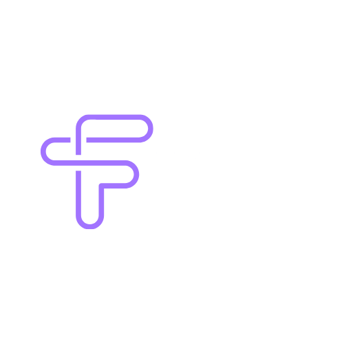

<div align="center">
  
  <h1>Agent Finny</h1>
</div>

**AI-powered CFO assistant for startups** - Real-time financial insights with AI-driven automation.

## 🎯 Live Demo

- **🌐 Live Website:** [https://agent-finny.vercel.app/](https://agent-finny.vercel.app/)

### 📺 **Demo Video**
**[Watch Demo Video on YouTube →](https://www.youtube.com/watch?v=fRZdHzfZcdM)**

## 🏆 Built for Startup Track

**Agent Finny** is built for the Y Combinator startup track, helping early-stage founders manage their finances intelligently with AI-powered insights.

---

## 🛠️ Tech Stack

Built with industry-leading tools and platforms:

<div align="center">
  


</div>

**Tech Partners:**
- **Y Combinator** - Startup accelerator
- **OpenAI** - AI reasoning and insights
- **Redis** - Vector database for LLMs
- **Lava Payments** - AI API payment infrastructure
- **Plaid** - Bank account connections

---

## �� Demo Ready (60-90s pitch)

Agent Finny connects your bank, analyzes transactions, and provides AI-powered CFO insights in seconds.

### Demo Flow

1. **Onboard** → Enter startup name
2. **Connect Bank** → Plaid Link OR one-click demo data
3. **Dashboard** → View KPIs, charts, and AI insights

**Test Credentials (Plaid Sandbox):**
- Username: `user_good`
- Password: `pass_good`
- MFA: `1234`

---

## 🏗️ Architecture

```
agent-finny/
├── backend/          # FastAPI + Plaid + Supabase + Lava
│   ├── app/
│   │   ├── main.py       # FastAPI app entry
│   │   ├── plaid.py      # Plaid integration (Link, exchange, demo seeding)
│   │   ├── metrics.py    # Financial metrics calculations
│   │   └── agent.py      # AI CFO insights (Lava-powered)
│   ├── requirements.txt
│   └── .env             # Backend config
│
└── frontend/         # Next.js 15 + Tailwind + Chart.js
    ├── app/
    │   ├── page.tsx          # Onboarding
    │   ├── connect/          # Bank connection (Plaid Link)
    │   └── dashboard/        # Financial dashboard
    └── .env.local       # Frontend config
```

---

## 🚀 Quick Start

### Prerequisites

- Python 3.13+
- Node.js 18+
- Plaid account (sandbox)
- Supabase project
- Lava API key

### 1. Backend Setup

```bash
cd backend

# Create virtual environment
python -m venv venv
.\venv\Scripts\activate  # Windows
# source venv/bin/activate  # macOS/Linux

# Install dependencies
pip install -r requirements.txt

# Configure environment
cp .env.example .env
# Edit .env with your credentials

# Start server
uvicorn app.main:app --reload --port 8080
```

**Backend runs at:** http://localhost:8080

### 2. Frontend Setup

```bash
cd frontend

# Install dependencies
npm install

# Configure environment
echo "NEXT_PUBLIC_API_URL=http://localhost:8080" > .env.local

# Start dev server
npm run dev
```

**Frontend runs at:** http://localhost:3000

---

## 🔌 API Endpoints

### Plaid Integration
- `POST /plaid/link-token` - Create Plaid Link token
- `POST /plaid/exchange` - Exchange public token → fetch transactions
- `POST /plaid/demo-item` - Load sandbox demo data (one-click)

### Financial Metrics
- `POST /metrics/summary` - Revenue/expense by month, MTD/YTD, top categories
- `POST /metrics/burn_runway` - 3-month burn rate, cash balance, runway

### AI Agent
- `POST /agent/insights` - AI CFO analysis (Lava → Groq)

**API Docs:** http://localhost:8080/docs

---

## 🔑 Environment Variables

### Backend (`backend/.env`)

```bash
# Plaid
PLAID_ENV=sandbox
PLAID_CLIENT_ID=<from Plaid dashboard>
PLAID_SECRET=<sandbox secret>

# Supabase
SUPABASE_URL=<project URL>
SUPABASE_SERVICE_ROLE=<service role key>

# Lava (AI payments)
LAVA_FORWARD_URL=https://api.lavapayments.com/v1/forward?u=
LAVA_API_KEY=<your API key>
LAVA_SELF_CONNECTION_SECRET=<connection secret>
LAVA_SELF_PRODUCT_SECRET=<product secret>
AI_CHAT_URL=https://api.groq.com/openai/v1/chat/completions
```

### Frontend (`frontend/.env.local`)

```bash
NEXT_PUBLIC_API_URL=http://localhost:8080
```

---

## 📊 Database Schema (Supabase)

### `transactions` table

```sql
CREATE TABLE transactions (
  id TEXT PRIMARY KEY,
  workspace_id UUID NOT NULL,
  ts DATE NOT NULL,
  amount NUMERIC NOT NULL,
  category TEXT,
  merchant TEXT,
  note TEXT,
  source TEXT,
  raw JSONB
);

CREATE INDEX idx_workspace_ts ON transactions(workspace_id, ts);
```

### `cash_snapshots` table (optional)

```sql
CREATE TABLE cash_snapshots (
  workspace_id UUID NOT NULL,
  as_of DATE NOT NULL,
  cash NUMERIC NOT NULL,
  PRIMARY KEY (workspace_id, as_of)
);
```

---

## 🎨 Technology Details

### Backend
- **FastAPI** - Modern Python API framework
- **Plaid** - Bank account connections
- **Supabase** - PostgreSQL database
- **Lava Payments** - AI API payment infrastructure
- **OpenAI** - AI reasoning and insights
- **Redis** - Vector database for LLMs

### Frontend
- **Next.js 15** - React framework (App Router)
- **Tailwind CSS** - Styling
- **Chart.js** - Data visualization
- **Plaid Link** - Bank connection UI
- **Axios** - HTTP client

---

## 🧪 Testing

### Backend Tests

```bash
cd backend

# Test health
curl http://localhost:8080/health

# Test Plaid seeding
curl -X POST http://localhost:8080/plaid/demo-item \
  -H 'content-type: application/json' \
  -d '{"workspace_id":"eff079c8-5bf9-4a45-8142-2b4d009e1eb4"}'

# Test metrics
curl -X POST http://localhost:8080/metrics/summary \
  -H 'content-type: application/json' \
  -d '{"workspace_id":"eff079c8-5bf9-4a45-8142-2b4d009e1eb4"}'

# Test AI insights
curl -X POST http://localhost:8080/agent/insights \
  -H 'content-type: application/json' \
  -d '{"workspace_id":"eff079c8-5bf9-4a45-8142-2b4d009e1eb4"}'
```

### Frontend Test

1. Navigate to http://localhost:3000
2. Enter startup name → Continue
3. Click "Load Demo Data (One-Click)"
4. View dashboard with metrics and charts
5. Click "Ask Finny" for AI insights

---

## 🎤 Judge Demo Script

**Total time: 60-90 seconds**

1. **Intro** (10s)
   - "Agent Finny is an AI-powered CFO assistant that gives startups real-time financial insights"

2. **Onboard** (10s)
   - Enter "Acme Robotics"
   - Click Continue

3. **Connect** (15s)
   - Show Plaid Link option: "In production, users connect their real bank"
   - Click "Load Demo Data" for instant seeding
   - "17 transactions loaded in <1 second"

4. **Dashboard** (30s)
   - **KPIs**: "Cash: $45k, Burn: $11k/month, Runway: 4 months"
   - **Chart**: "Revenue vs expenses by month"
   - **Top Categories**: "Biggest spend areas"

5. **AI Insights** (20s)
   - Click "Ask Finny"
   - **Highlight**: "AI analysis in <1 second via Lava"
   - Read summary: burn rate, runway warning, recommendations
   - "Powered by Lava's AI payment routing to Groq"

6. **Close** (5s)
   - "All transactions processed through Lava for transparent AI costs"

---

## 🚀 Deployment

### Backend (Cloud Run / Railway / Render)

```bash
cd backend
# Add Dockerfile or deploy directly
gcloud run deploy agent-finny-backend --source .
```

### Frontend (Vercel)

```bash
cd frontend
vercel --prod
```

Set `NEXT_PUBLIC_API_URL` to your backend URL.

---

## 💡 Key Features

✅ **Plaid Integration** - Connect any US bank account  
✅ **Real-time Metrics** - Revenue, expenses, burn rate, runway  
✅ **AI-Powered Insights** - CFO-level analysis in seconds  
✅ **Lava Payments** - Transparent AI API costs  
✅ **Beautiful UI** - Modern, responsive design  
✅ **Demo Ready** - One-click sandbox data  
✅ **Type Safe** - Full TypeScript frontend  

---

## 📝 License

MIT

---

## 🤝 Built With

- [Plaid](https://plaid.com) - Bank connections
- [Supabase](https://supabase.com) - Database
- [Lava](https://lavapayments.com) - AI payments
- [Groq](https://groq.com) - Fast LLM inference
- [Next.js](https://nextjs.org) - React framework
- [FastAPI](https://fastapi.tiangolo.com) - Python API framework

---

**Workspace ID for testing:**
```
eff079c8-5bf9-4a45-8142-2b4d009e1eb4
```

**Demo ready!** 🎉
